# PCB Designs
These designs are based on projects from KiCad Like a Pro (Edition 4). While the schematics and overall board outlines follow the textbook closely, all routing, component selection, and placement were done independently.

## Beginner Design: Breadboard Power Supply
This PCB is a compact dual-voltage breadboard power supply designed to deliver 5V and 3.3V from a 6–12V wall adapter. It connects directly to a mini breadboard via pin headers and includes onboard voltage regulators (LM317 and LM7805), a barrel jack input, and selectable outputs—all laid out with through-hole components for easy assembly.

**3D-View:**
<table>
  <tr>
    <td>
      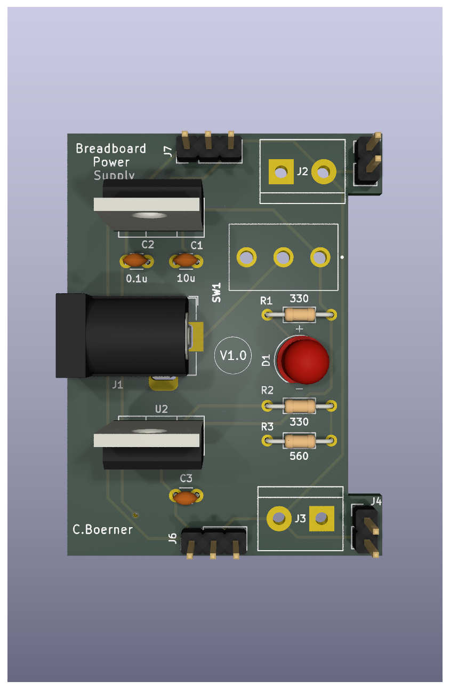
    </td>
    <td>
      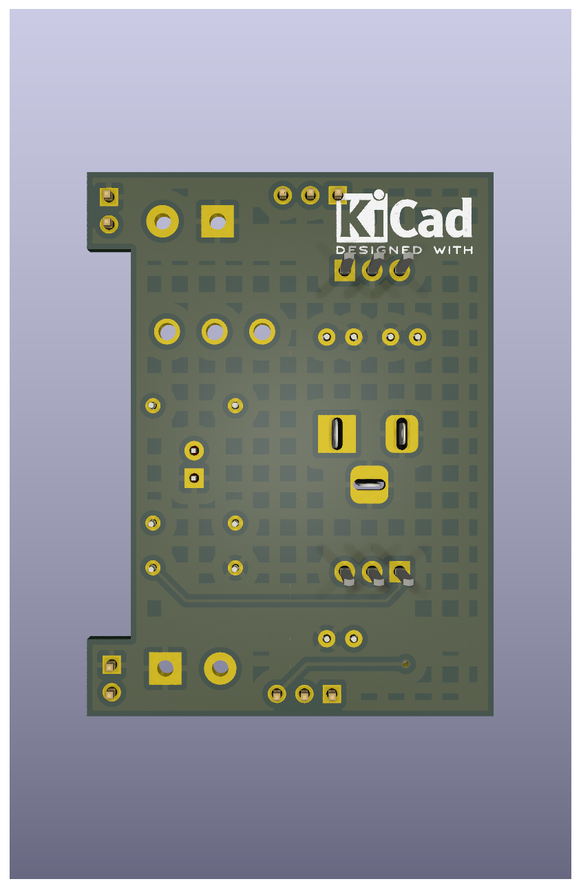
    </td>
  </tr>
</table>

**Schematic:**
<table>
  <tr>
    <td>
      
    </td>
  </tr>
</table>

**Layout:**
<table>
  <tr>
    <td>
      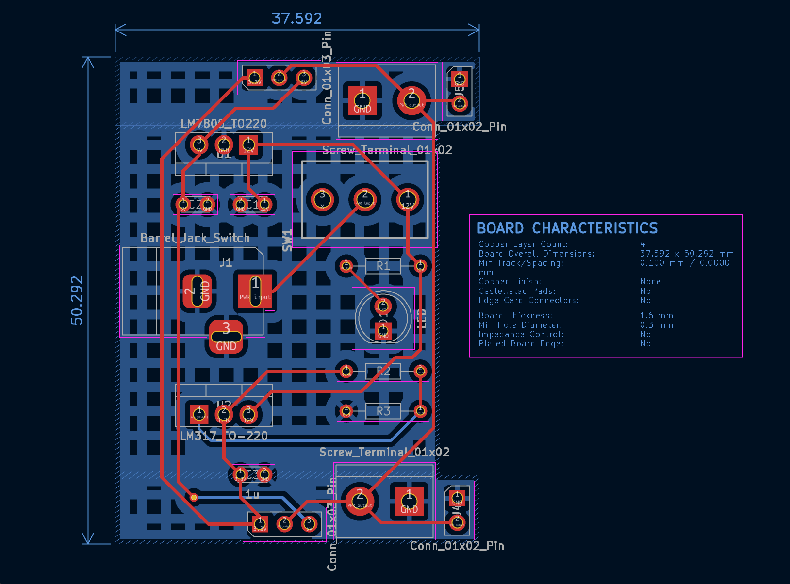
    </td>
  </tr>
</table>

## Intermediate Design: Solar Power Regulator
This PCB is a solar-powered 3.3V boost converter based on Clemens Valens’ Tiny Solar Supply, originally published by Elektor. Designed in KiCad, it steps up the voltage from a small solar panel and rechargeable battery using the AP3015 IC—ideal for powering low-power microcontrollers.

**3D-View:**
<table>
  <tr>
    <td>
      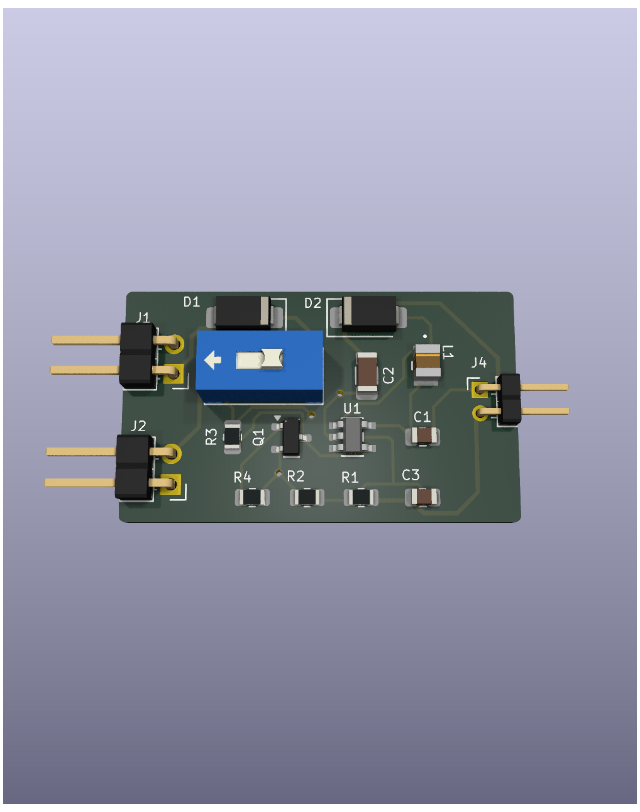
    </td>
    <td>
      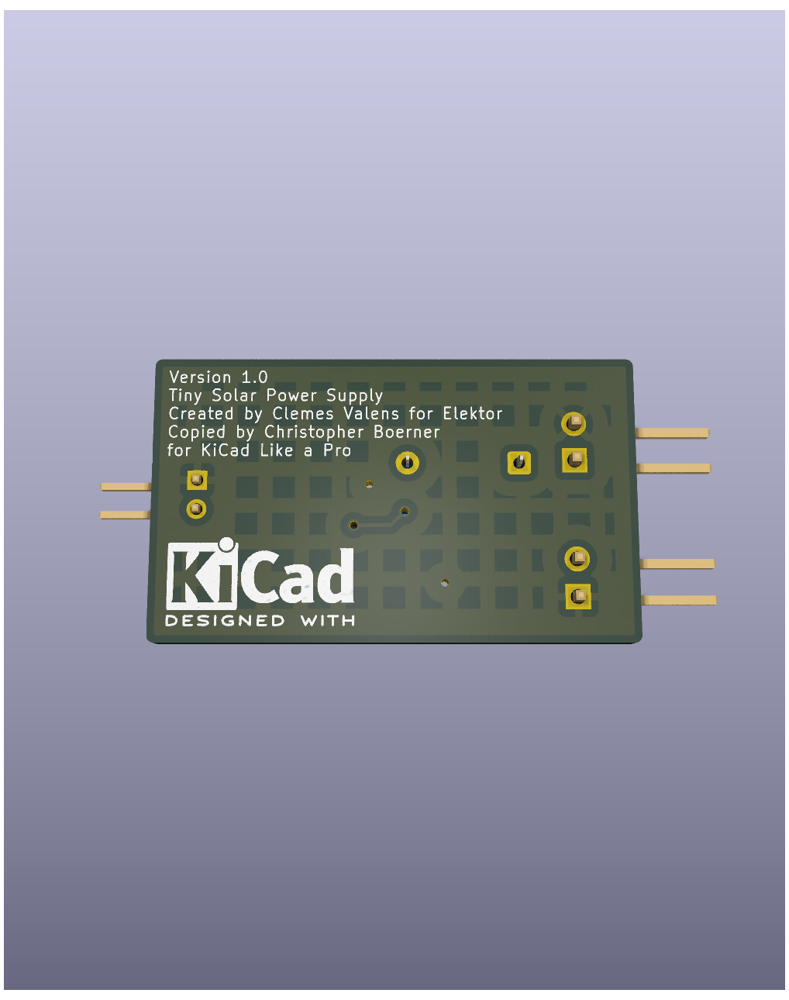
    </td>
  </tr>
</table>

**Schematic:**
<table>
  <tr>
    <td>
      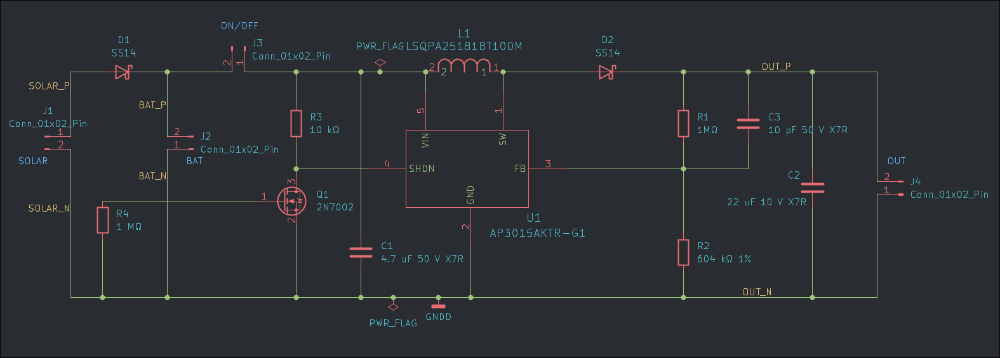
    </td>
  </tr>
</table>

**Layout:**
<table>
  <tr>
    <td>
      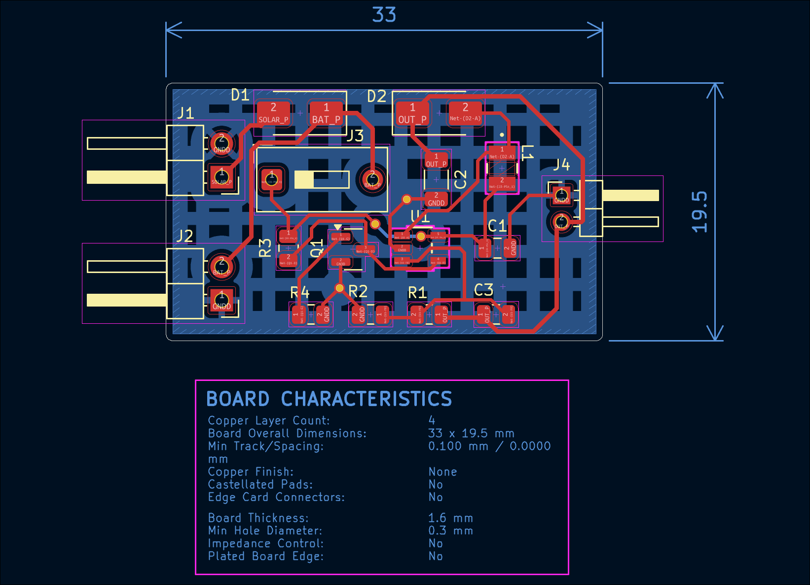
    </td>
  </tr>
</table>

## Advanced Design: ESP32 Clone
This ESP32 development board is based on Espressif’s official reference design for the DevKitC-V4. I followed the original schematic and layout closely, using KiCad for all design work and customizing the footprint placement and component sizing for easier hand assembly/soldering. This project emphasizes working from manufacturer reference designs and practicing dense PCB layout techniques.

**3D-View:**
<table>
  <tr>
    <td>
      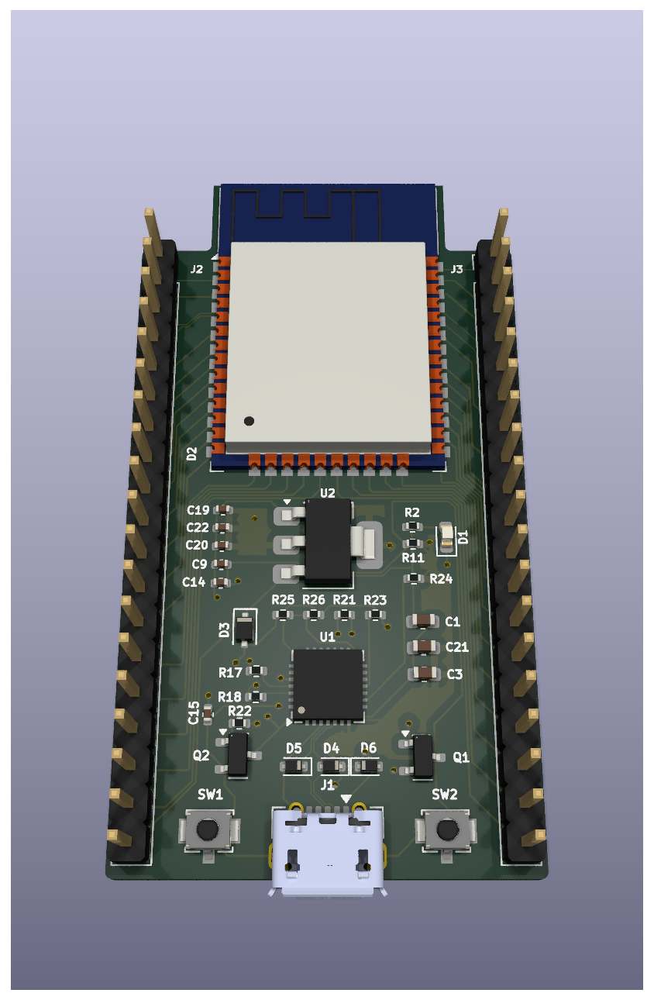
    </td>
    <td>
      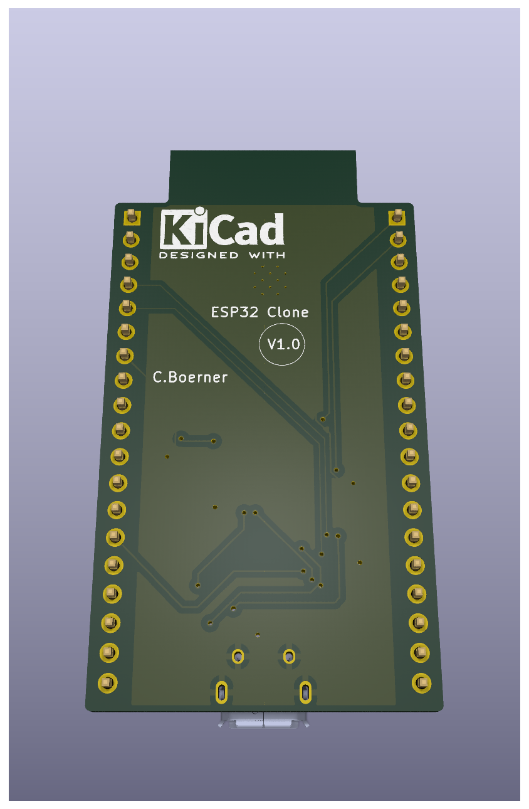
    </td>
  </tr>
</table>

**Schematic:**
<table>
  <tr>
    <td>
      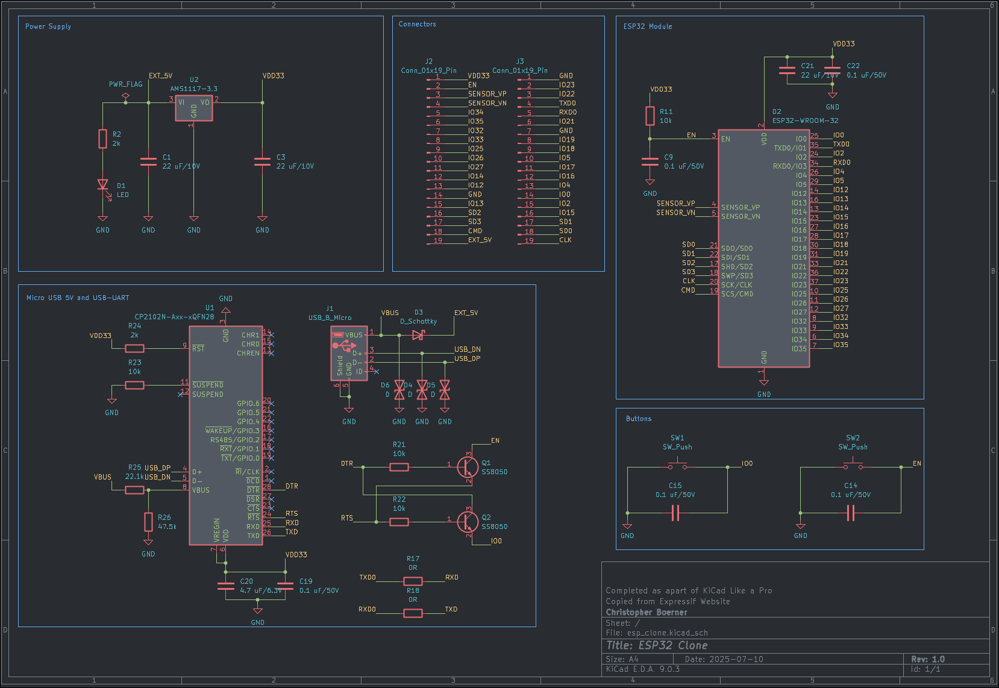
    </td>
  </tr>
</table>

**Layout:**
<table>
  <tr>
    <td>
      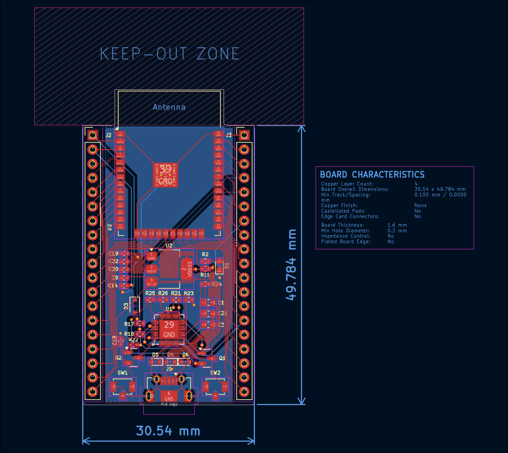
    </td>
  </tr>
</table>
